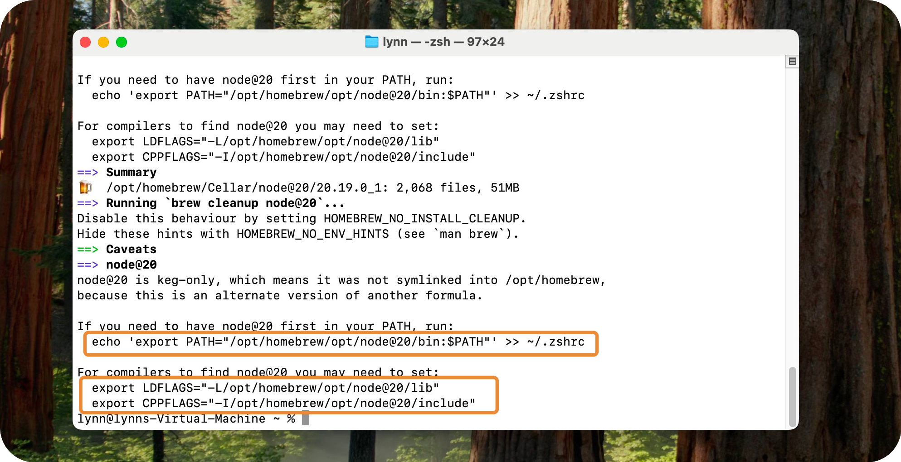

# MAC-OS SETUP INSTRUCTIONS


In this doc you'll find the instructions you need to make sure you're ready to go for vibe-coding from your MacOS terminal!

# 🧪 Create a GitHub Account

Sign up to GitHub [here](https://github.com/signup).

> [!TIP]
> I recommend using a non-work email address. You can ensure your work is accesisble to a company GitHub account later by adding our team's account as a collaborator to your projects

# 🔨 Enable XCode Command Line Tools 

**1. Launch a Terminal window**

Type `CMD + Space` and type "Terminal"

**2. Install XCode Developer Tools**

```zsh
xcode-select --install
```
Approve all installation prompts and, once finished, quit and reopen your terminal.

**3. Verify Installation**

```zsh
git --version
``` 

If installation was successful, you'll see a version number. Else, you'll get an error.

# ☕️ Install Homebrew

Homebrew is a package (program) manager for Mac and Linux that allows you to easily install a bunch of tools and utilities easily in the future.

**1. Run Installation Script**

```zsh
/bin/bash -c "$(curl -fsSL https://raw.githubusercontent.com/Homebrew/install/HEAD/install.sh)"
```

**2. Complete Homembrew Setup**

Once Homebrew is finished downloading, you should see a "Next steps" section containing three commands for you to run on your Terminal.

For each of the 3 highlighted lines below: Select and copy the entire line from your Terminal, paste it on the command line, and hit `RETURN`

You may copy-paste as usual by selecting the text and hitting `Cmd + C` and `Cmd +V`


**3. Verify Installation**

1. Quit and reopen your terminal
2. Run the command `brew --version`

If the installation was successful, you'll get a version number like _Homebrew 4.6.17_, else you'll get an error.

# 💚 Install NodeJS

NodeJS allows you to run JavaScript-based applications and commands. This includes AI coding tools like **Codex, Gemini, Claude Code**, etc. In your terminal, type and run the following command:

**1. Install NodeJS via Homebrew**

```zsh
brew install node@20 
```

Once done, you'll see a set of instructions similar to the ones you saw when installing Homebrew.

Like before, **copy the highlighted lines as printed by your own Terminal** and hit ENTER




**2. Verify Installation**

1. Close and reopen your Terminal
2. Run the following commands:

```zsh
node -v
```
```zsh
npm -v
```

# 👾 Install VSCode

VSCode is a GUI code editor which seamlessly integrates with extensions such as `codex`, `claude code`, etc.

If you'll be vibe-coding, I recommend installing VSCode as it will allow you to make changes more easily if you ever need to make small manual edits.

[Install VSCode here](https://code.visualstudio.com/download)
