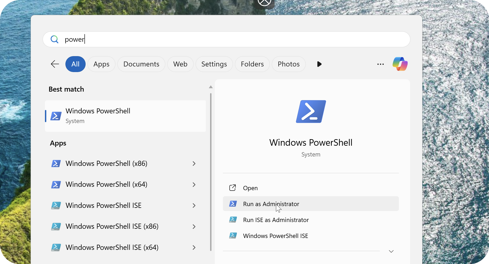
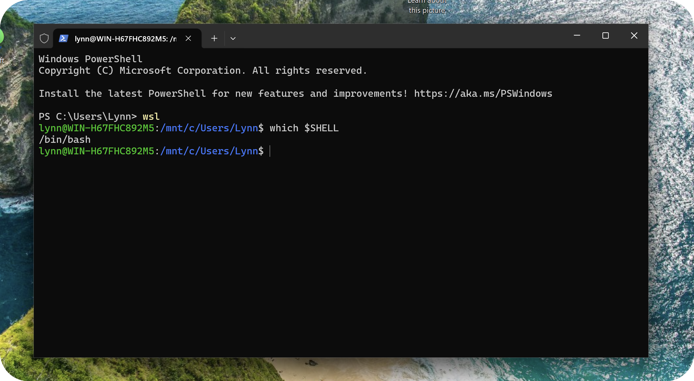
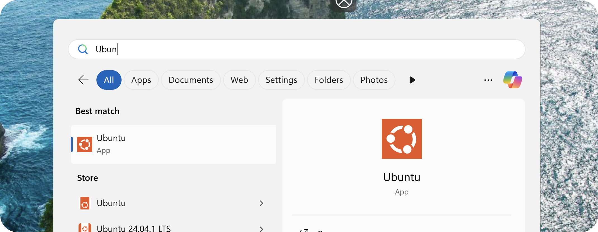

# WINDOWS SETUP INSTRUCTIONS


In this doc you'll find the instructions you need to make sure you're ready to go for vibe-coding from your Linux terminal!

> [!WARNING]
> This setup guide involves a lot of Command Line usage.
> Command lines (Powershell, Terminal, etc) are text user interfaces (TUIs). This means that they really _really love_ text and won't let you interact with them through your mouse. For example, you won't be able to move your typing cursor with you mouse.

> [!TIP]
> Navigate around your text, simply use your **keyboard's arrows**.
> Ignore your current line and start a new one by hitting `CTRL + C`
> Cancel/stop any commands with `CTRL + C`

# 🧪 Create a GitHub Account

Sign up to GitHub [here](https://github.com/signup).

> [!TIP]
> I recommend using a non-work email address. You can ensure your work is accesisble to a company GitHub account later by adding our team's account as a collaborator to your projects


# 🐧 Install WSL

**1. Launch an Administrator Powershell**

`Win > Powershell > Run as administrator`



**2. Install the WSL Virtual Machine Platform**

```powershell
wsl --install
```

> [!NOTE]
> You may be prompted to reboot your system. Please restart your computer as you normally would and open a new Administrator Powershell

**3. Install Our Linux Distribution**

```powershell
wsl --install -d Ubuntu
```
Wait until you see your **shell prompt** appear at the bottom of your Powershell window once again (that's the bit that looks something like `PS C:\Windows\System32>`). That means the installation is finished. You will be prompted to create a new user.

**4. Create New User**

1. Inside the Windows Powershell, type a new user name (this can be anything) and hit `ENTER`
2. You will then be prompted to type your password. Make sure to type something you remember

> [!IMPORTANT]
> When entering passwords on any command line interface, **you will not see anything being typed out**. You won't see any characters or placeholders, no cursor movement or anything. It will look as if nothing is happening. **This is normal**.
> Please type your password carefully and hit `ENTER` when ready

**5. Activate WSL**

This is the fun part! What we've just installed is essentially a TUI-only version of Linux that we can intercat with via our command line! However, in order for your Windows computer to _understand_ when you want to run Linux commands vs Powershell commands, you need to first activate your WSL virtual machine. To do so, run:

```powershell
wsl
```

- You will know you are inside Linux when your **shell prompt** turns <span style="color:green">green</span>
- You can further verify you are running Linux by checking which SHELL you are running: `which $SHELL`
- Should print `/bin/bash`. BASH is the language used for interacting with Linux via the command line!



**7. Exiting WSL**

In order to exit WSL and go back to your normal Windows Powershell, simply run `exit`

---
> [!IMPORTANT]
> All remaining instructions must be carried out _inside_ WSL. Make sure your Linux terminal is active! Either via the `wsl` command in PowerShell or by opening the Ubuntu app from the Windows menu

`Win > Ubuntu`



> [!TIP]
> Pasting inside your Linux terminal is a little different. Instead of `CTRL + V` try `SHIFT + CTRL + V` or simply **right click**

# 💚 Install NodeJS

NodeJS allows you to run JavaScript-based applications and commands

**1. Update System**

```bash
sudo apt update
sudo apt upgrade
sudo apt install -y curl
```

**2. Install the NodeJS Source Repository**

```bash
curl -fsSL https://deb.nodesource.com/setup_20.x | sudo -E bash -
```

**3. Install NodeJS**

```bash
sudo apt install -y nodejs
```

**4. Verify Installation**


```bash
node -v
npm -v
```

# 👾 Install VSCode

VSCode is a GUI code editor which seamlessly integrates with extensions such as `codex`, `claude code`, etc.

If you'll be vibe-coding, I recommend installing VSCode as it will allow you to make changes more easily if you ever need to make small manual edits.

You can install VSCode from the Windows app store.

